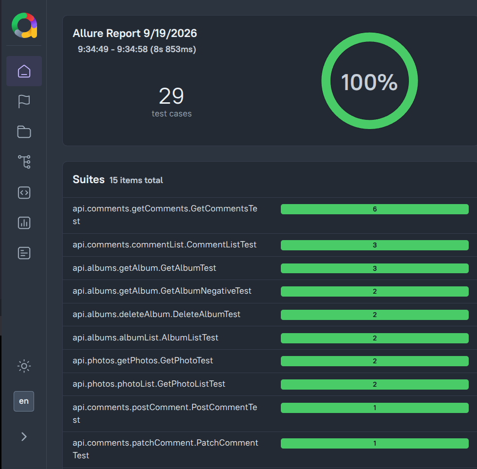

[](https://github.com/Nagraggini/jsonplaceholder-demo-api/actions/workflows/maven-tests.yml)


 


# JSONPlaceholder API Test Automation

Automated REST API test automation framework built with **Java 21**, **REST Assured**, **JUnit 5**, **Jackson**, **Allure Report**, and **Maven**.

The project tests the free [JSONPlaceholder](https://jsonplaceholder.typicode.com/) fake REST API, focusing on positive and negative test scenarios, status code validations, JSON schema and body assertions, dynamic query parameters, and POJO serialization/deserialization.

## Allure Test Report

The automated test results and execution reports are generated and published automatically via GitHub Actions:

         

📊 [View the Live Allure Report](https://nagraggini.github.io/jsonplaceholder-demo-api/)

## Technologies Used

- **Java 21**
- **REST Assured 5.5.6**
- **JUnit 5**
- **Jackson Databind** (POJO mapping)
- **Allure Framework** (Reporting)
- **Maven** (Build & Dependency Management)

## Covered Endpoints & Test Scenarios

### Albums (`/albums`)
- Fetch full album lists and validate response structures.
- Fetch individual albums by ID (Positive & Negative 404 cases).
- Filter albums by `userId`.
- Create new albums (`POST`) and validate dynamic response data.
- Update (`PUT`) and remove (`DELETE`) albums.

### Comments (`/comments`)
- Fetch and validate full and filtered comment collections.
- Create (`POST`), full update (`PUT`), partial update (`PATCH`), and delete (`DELETE`) comments.
- Verify payload fields (`postId`, `name`, `email`, `body`).

### Photos (`/photos`)
- Retrieve individual photo details and photo lists.
- Validate photo metadata (`albumId`, `title`, `url`, `thumbnailUrl`).

---

## Project Structure

```text
src/test/java
├── albumsPOJO
│   └── Album.java
├── commentPOJO
│   └── Comment.java
├── photoPOJO
│   └── Photo.java
├── api
│   ├── albums
│   ├── comments
│   └── photos
└── base
    └── BaseApiTest.java

```

## Running the tests

### Prerequisites

- Java 21 or newer
- Internet connection

The Maven Wrapper is included, so a separate Maven installation is not required.

### Linux and macOS

```bash
chmod +x mvnw
./mvnw clean test

```

### Windows (PowerShell)
```powershell
mvnw.cmd clean test

```

## Learning goals

This project demonstrates my practical experience with:

- arranging requests with `given–when–then` syntax;
- validating status codes and JSON response bodies;
- using Hamcrest matchers;
- sending query parameters and request bodies;
- handling positive and negative test cases;
- mapping JSON responses to Java objects;
- extracting values and complete responses for further validation;
- organizing reusable API test configuration.